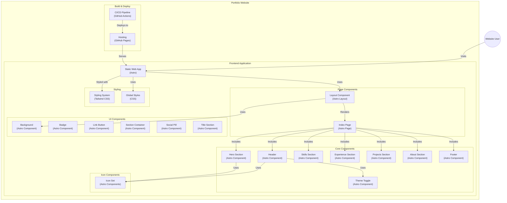

```mermaid
graph TB
    User((Website User))

    subgraph "Portfolio Website"
        subgraph "Frontend Application"
            WebApp["Static Web App<br>(Astro)"]
            
            subgraph "Page Components"
                MainLayout["Layout Component<br>(Astro Layout)"]
                IndexPage["Index Page<br>(Astro Page)"]
            end
            
            subgraph "Core Components"
                Header["Header<br>(Astro Component)"]
                Hero["Hero Section<br>(Astro Component)"]
                Skills["Skills Section<br>(Astro Component)"]
                Experience["Experience Section<br>(Astro Component)"]
                Projects["Projects Section<br>(Astro Component)"]
                About["About Section<br>(Astro Component)"]
                Footer["Footer<br>(Astro Component)"]
                ThemeToggle["Theme Toggle<br>(Astro Component)"]
            end

            subgraph "UI Components"
                Background["Background<br>(Astro Component)"]
                Badge["Badge<br>(Astro Component)"]
                LinkButton["Link Button<br>(Astro Component)"]
                SectionContainer["Section Container<br>(Astro Component)"]
                SocialPill["Social Pill<br>(Astro Component)"]
                TitleSection["Title Section<br>(Astro Component)"]
            end

            subgraph "Icon Components"
                Icons["Icon Set<br>(Astro Components)"]
            end

            subgraph "Styling"
                TailwindCSS["Styling System<br>(Tailwind CSS)"]
                GlobalStyles["Global Styles<br>(CSS)"]
            end
        end

        subgraph "Build & Deploy"
            GithubActions["CI/CD Pipeline<br>(GitHub Actions)"]
            GithubPages["Hosting<br>(GitHub Pages)"]
        end
    end

    %% Relationships
    User -->|"Visits"| WebApp
    
    %% Layout Structure
    WebApp -->|"Uses"| MainLayout
    MainLayout -->|"Renders"| IndexPage
    
    %% Page Component Relations
    IndexPage -->|"Includes"| Header
    IndexPage -->|"Includes"| Hero
    IndexPage -->|"Includes"| Skills
    IndexPage -->|"Includes"| Experience
    IndexPage -->|"Includes"| Projects
    IndexPage -->|"Includes"| About
    IndexPage -->|"Includes"| Footer
    
    %% Component Dependencies
    Header -->|"Uses"| ThemeToggle
    MainLayout -->|"Uses"| Background
    
    %% Styling Dependencies
    WebApp -->|"Styled with"| TailwindCSS
    WebApp -->|"Uses"| GlobalStyles
    
    %% Icon Usage
    Header -->|"Uses"| Icons
    Hero -->|"Uses"| Icons
    
    %% Deployment Flow
    GithubActions -->|"Deploys to"| GithubPages
    GithubPages -->|"Serves"| WebApp
```